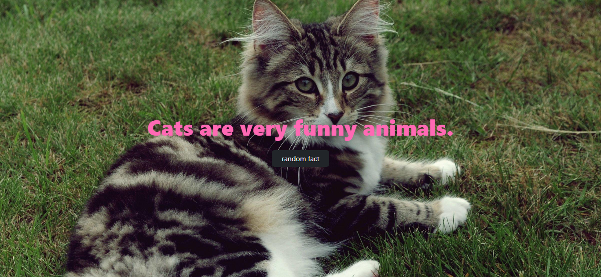
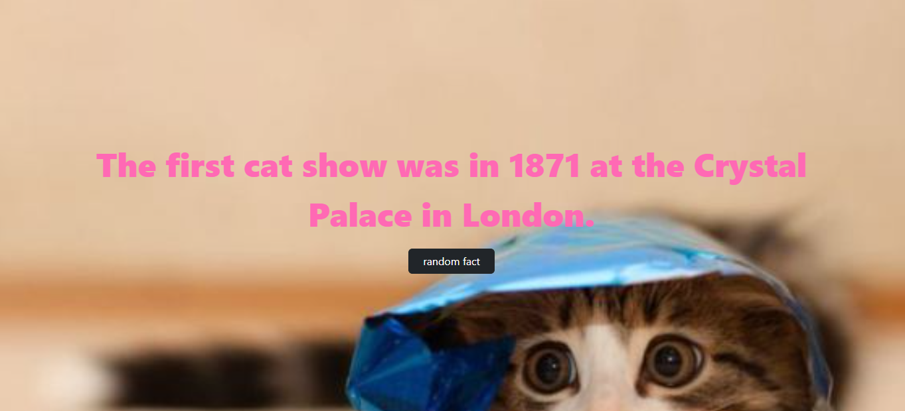

<h1 align="center" style="font-weight: bold;">Catpedia 💻</h1>

<p align="center">
 <a href="#tech">Technologies</a> • 
 <a href="#started">Getting Started</a> • 
  <a href="#routes">API Endpoints</a> •
 <a href="#contribute">Contribute</a>
</p>

<p align="center">
    <b>🐈 Your cat-fact of the day. You get a new cat fact and photo each time you press 'random fact', from the 'cat-fact' and 'thecatapi'. Project developed to exercise the use of public API's 🐈</b>
</p>

<h2 id="technologies">💻 Technologies</h2>

- Javascript
- HTML
- CSS

<h2 id="layout">🎨 Layout</h2>

<p align="center">
    
    
</p>

<h2 id="started">🚀 Getting started</h2>

To run the project locally, follow the steps:

<h3>Prerequisites</h3>

Here you list all prerequisites necessary for running the project:

- [NodeJS](https://github.com/)
- [Git 2](https://github.com)

<h3>Cloning</h3>

How to clone the project

```bash
git clone https://github.com/ylanaleal/catpedia.git
```

<h3>Starting</h3>

How to start the project

```bash
cd catpedia
npm i
nodemon index.js
```

<h2 id="routes">📍 API Endpoints</h2>

| route               | description                                          
|----------------------|-----------------------------------------------------
| <kbd>GET /</kbd>     | retrieves the info from the API's 'cat-fact' and 'thecatapi'
​
<h2 id="contribute">📫 Contribute</h2>

1. `git clone https://github.com/ylanaleal/catpedia.git`
2. `git checkout -b feature/NAME`
3. Follow commit patterns
4. Open a Pull Request explaining the problem solved or feature made, if exists, append screenshot of visual modifications and wait for the review!

<h3>Documentations that might help</h3>

[📝 How to create a Pull Request](https://www.atlassian.com/br/git/tutorials/making-a-pull-request)

[💾 Commit pattern](https://gist.github.com/joshbuchea/6f47e86d2510bce28f8e7f42ae84c716)
